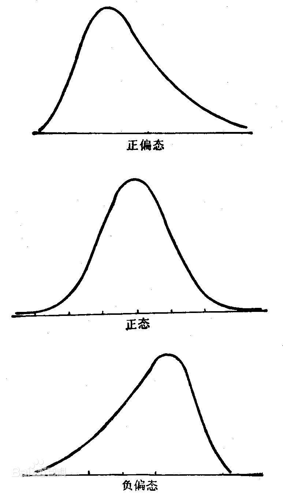

## PySpark 学习笔记

### RDD
RDD 是 Spark 的核心; 这些无 schema(模式) 数据结构是在 Spark 中处理的最基本的数据结构. 
Spark 中的转化是惰性的, 它们只在操作被调用时应用. 
Scala 和 Python RDD 之间一个主要的区别是速度: Python RDD 比 Scala 慢很多. 

DataFrame 是使 PySpark 应用程序与 Scala 中编写的数据结构相符的数据结果. 

### DataFrame
DataFrame 是一种不可变的分布式数据集, 这种数据集被组织成指定的列, 类似于关系数据库中的表. 
SchemaRDD 指为 Apache Spark 1.0 版本中的试验性功能, 它在 Apache Spark 1.3 版本中被命名为 DataFrame. 

### 百科

#### 偏态分布
偏态分布是与 "正态分布" 相对, 分布曲线左右不对称的数据次数分布, 是连续随机变量概率分布的一种. 
可以通过峰度和偏度的计算, 衡量偏态的程序. 可分为正偏态和负偏态, 前者曲线右侧偏长, 左侧偏短; 后者曲线左侧偏长, 右侧偏短. 

在数据统计中: 

如, 正偏态: 均值离最小值比较近, 离最大值较远. 

#### 数据的变异性

* 极差: 全距, range, 数据组中的最大值减去最小值, 是对变异性最笼统的测量. 
通过极差可以了解数值之间彼此差异的程度, 掌握数据组中从最小值到最大值之间的距离. 
* 标准差: standard deviation, variance, 数据组中所有数值与均值的平均距离. 表示数据组中变异性的平均数量. 
* 变异系数: coefficient of variation, 标准差对均值的百分比. 由于标准差的单位和数据值的单位相同, 若想比较两组不同单位的数据的变异性大小, 
就无法直接比较其标准差了. 但若使用变异系数, 得到的是无单位的百分比, 就可以让不同的数据组相互比较. 
* 方差: 标准差的平方. 
